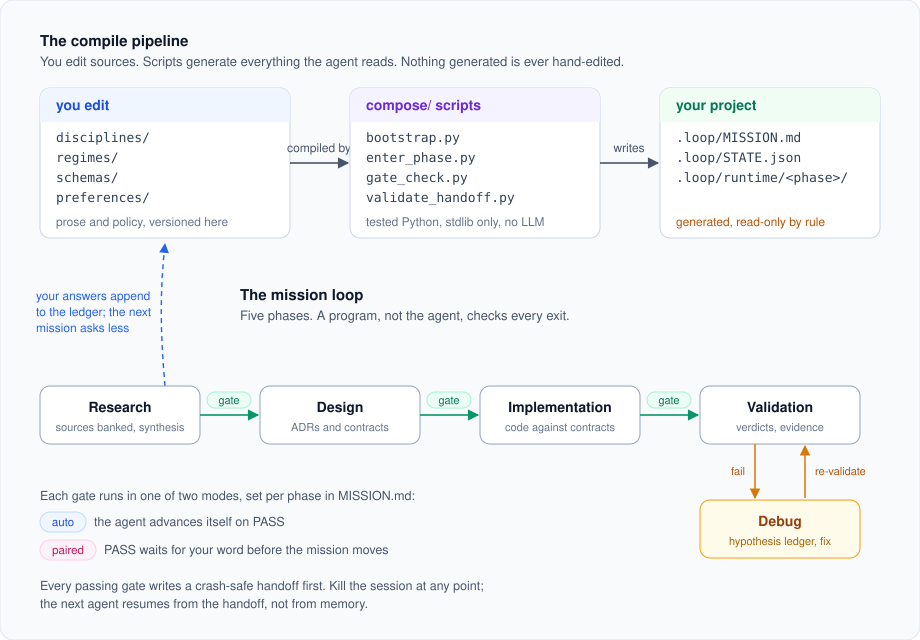

# agentic-loop

An operating system for AI coding agents on long missions. Five phases, a
gate program at every exit, instructions compiled per phase instead of
loaded wholesale, and a preference ledger that remembers your answers so
the next mission asks you less.

[](LICENSE)
[](compose)
[](compose)
[](.claude/commands)



## The problem this solves

Agents on multi-day tasks fail in predictable ways. They read the whole
repo and drown their context. They grade their own work and pass
themselves. They crash mid-task and the next session starts from zero.
They ask you the same taste questions on every project, forever.

Each failure gets a mechanical fix here, not a prompt asking the model to
try harder:

| Failure | Fix | Where |
|---|---|---|
| Context flooding | Scripts compile a per-phase instruction file and print an exact reading list. The agent loads only that. | [compose/enter_phase.py](compose/enter_phase.py) |
| Self-graded work | Phase exits are checked by a Python program against artifact contracts. PASS or FAIL, no vibes. | [compose/gate_check.py](compose/gate_check.py) |
| Crash amnesia | Every passing gate writes a validated handoff before the mission advances. Any later session resumes from it. | [disciplines/handoff.md](disciplines/handoff.md) |
| Groundhog-day questions | Intent answers append to a preference ledger with scope and provenance. Answered once means asked never again. | [preferences/PREFERENCES.md](preferences/PREFERENCES.md) |
| Silent capability loss | Missing tools are announced and the mission continues lane-capped. Degradation is declared, never discovered later. | [constitution/principles.md](constitution/principles.md) |

## How it works

The repo is a compiler, and the agent runs its output.

**Sources you edit.** [disciplines/](disciplines) holds the workflow prose
(research, design, implementation, validation, debug, handoff, grilling).
[regimes/](regimes) binds mode and phase to policy as plain JSON.
[schemas/](schemas) defines what each artifact must contain for a gate to
accept it.

**Scripts that compile.** [compose/](compose) is tested Python with zero
dependencies. `bootstrap.py` adopts or resumes a project. `enter_phase.py`
gates the previous phase, resolves the current regime, and writes
`.loop/runtime/<phase>/INSTRUCTIONS.md` plus one mandate file per worker.
`gate_check.py` decides whether a phase is done.

**Output the agent obeys.** Everything under a project's `.loop/runtime/`
is generated. The rule has one sentence: edit sources, never output. If a
generated file looks wrong, the bug is in a discipline or a regime, and
that is where the fix goes.

A mission walks five phases: Research, Design, Implementation, Validation,
and Debug when validation fails. Each phase runs in one of two modes, set
per phase in `.loop/MISSION.md`. In `auto` the agent advances itself on
PASS. In `paired` the gate can pass but the mission waits for your word.
Flip any phase at any time; the flip takes effect at the next gate.

## Quick start

Requires `python3`, `git`, and an agent that can run shell commands.
Claude Code gets slash commands out of the box; anything else can call the
scripts directly.

```bash
git clone https://github.com/12mohamedhm/agentic-loop.git
```

```bash
cd /path/to/your/project && bash /path/to/agentic-loop/install.sh
```

Then, inside your project, tell the agent: `/loop`. Bootstrap detects init
versus resume, verifies the environment loudly, and prints the single next
command. From there the agent drives and you answer questions when they
surface.

## The commands

Installed into your project's `.claude/` by `install.sh`. Each command
file states its own completion criterion.

| Command | What it does |
|---|---|
| `/loop` | Adopt or resume the loop in this project. |
| `/enter` | Compile the current phase and load only the printed reading list. |
| `/gate` | Run the deterministic exit check; advance on PASS per the phase's mode. |
| `/handoff` | Write and validate a crash-safe handoff right now. |
| `/pair`, `/auto` | Flip a phase's mode (or all phases) and echo the new vector. |

Agents that are not Claude Code skip the slash commands and run the same
three scripts: `bootstrap.py`, `enter_phase.py`, `gate_check.py`. The
commands are thin wrappers, on purpose.

## What you do as the operator

Less than you'd think. You confirm the mission after the agent interviews
you on it. You say "advance" at paired gates. You answer intent questions
the ledger can't, and each answer becomes a ledger entry so it never comes
back. Six verbs the agent must never perform alone (secrets, spending,
tags, releases, deletions, publication) are listed in
[regimes/policy.json](regimes/policy.json) and always escalate to you.

The full walkthrough, including a ten-line worked mission, is in the
[operator's guide](docs/OPERATORS-GUIDE.md). Every section there ends with
"what you actually type".

## Repo layout

| Path | What it is |
|---|---|
| [SKILL.md](SKILL.md) | The sole agent entry point. Everything else is reached by pointers. |
| [constitution/](constitution) | The invariants, and the writing doctrine every other file follows. |
| [disciplines/](disciplines) | Workflow cores. The only prose you edit. |
| [regimes/](regimes) | Mode-by-phase bindings and the reversibility policy. Data you tune. |
| [schemas/](schemas) | Artifact contracts the gates check against. |
| [compose/](compose) | Bootstrap, phase compiler, gates. Code you test. |
| [hosts/](hosts) | Per-harness capability profiles. |
| [preferences/](preferences) | Your ledger. Grows across every project you run. |
| [templates/](templates) | Worker mandate stubs the compiler consumes. |
| [.claude/commands/](.claude/commands) | Slash commands the installer links into projects. |
| [docs/](docs) | Human-facing documentation and this diagram. |

## Design rules

Four rules carry most of the weight. They come from
[constitution/principles.md](constitution/principles.md), which also
records where each one was borrowed from (Fagan inspection, I-PASS
handoffs, mission command, hidden-profile research).

1. **One meaning, one home.** Every fact lives in exactly one file and is
   linked from everywhere else. If you find the same rule stated twice,
   that's a bug.
2. **Generated files are never hand-edited.** The compiler owns
   `.loop/runtime/`. Sources own the truth.
3. **Gates are programs.** An agent grading its own work will pass itself.
   A script checking artifact contracts won't.
4. **Degradation is declared.** A missing tool caps the lane and says so.
   Nothing fails quietly three phases later.

## Tests

```bash
python3 -m pytest compose/tests -q
```

Four golden-cell tests cover the compiler and gates. They run in under a
second and gate every release; nothing ships red.

## Contributing

See [CONTRIBUTING.md](CONTRIBUTING.md). The short version: edit sources,
run the tests, and write like
[constitution/writing-for-agents.md](constitution/writing-for-agents.md)
tells you to.

## License and credit

MIT, see [LICENSE](LICENSE). The agent-writing doctrine in
[constitution/writing-for-agents.md](constitution/writing-for-agents.md)
is adapted from [mattpocock/skills](https://github.com/mattpocock/skills)
(MIT).
